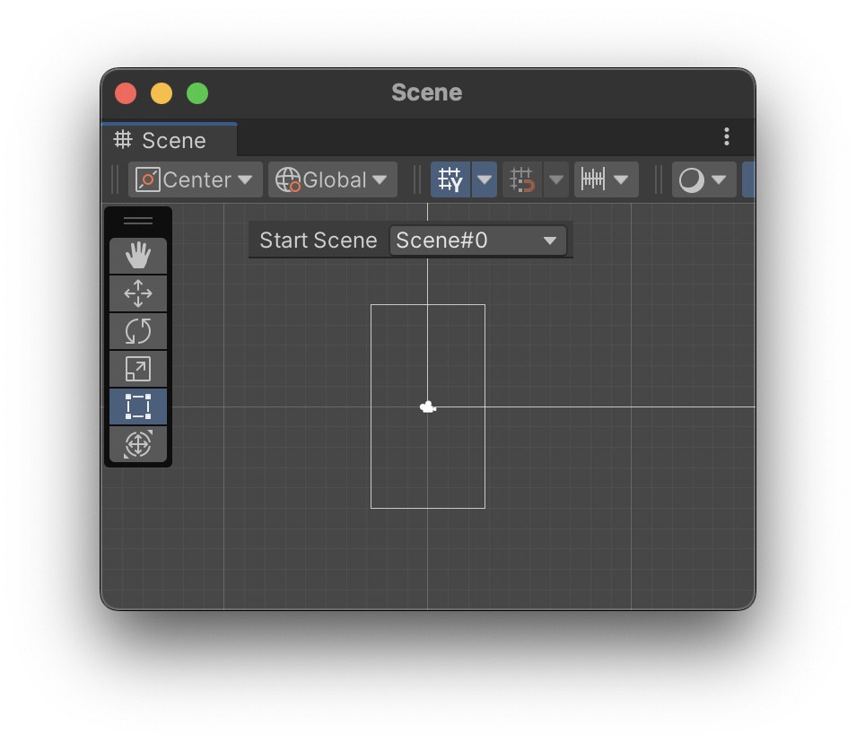
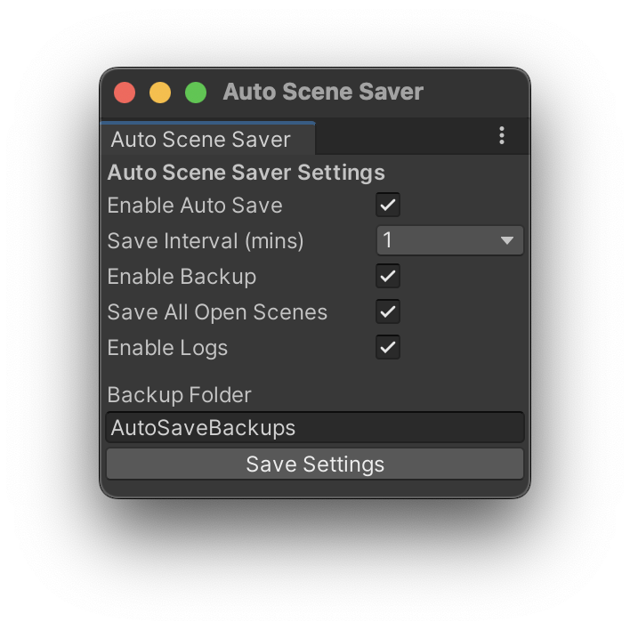

# Unity Scene Tools

**A collection of Unity Editor tools designed to improve scene management efficiency.**  
Currently includes:  
✔ **Default Start Scene Selection** – Easily choose a scene that always loads first in Play Mode.  
✔ **Auto Scene Saver** – Automatically saves and backs up scenes at regular intervals.

---

## 📌 Features

### 🎬 Default Start Scene Selection
A simple tool to set a **default scene** that always loads first when entering Play Mode.

✔ Choose a **default scene** from a dropdown  
✔ Automatically **updates when new scenes are added**  
✔ Centered UI in **Scene View toolbar**  
✔ Saves your selection between Unity sessions

---

### 💾 Auto Scene Saver
An automated scene-saving tool that helps prevent accidental data loss.

Go to **Unity Scene Tools > Auto Scene Saver**

✔ **Enable Auto Save** – Toggle auto-save on or off  
✔ **Set Time Interval** – Choose a save interval (1, 5, 10, or 30 minutes)  
✔ **Backup System** – Automatically create backups before saving  
✔ **Save All Open Scenes** – Option to save all open scenes or just the active one  
✔ **Auto Save History** – Keeps the last 5 backups  
✔ **Failure Warnings** – Get notified if an auto-save fails  
✔ **Smart Save** – Saves only if there are unsaved changes

---

## 🚀 Installation

Install **Unity Scene Tools** via Unity Package Manager:

1. Open your Unity project.
2. Go to **Window > Package Manager**.
3. Click on the **+** button at the top left and select **Add package from Git URL**.
4. Paste the following URL: `https://github.com/alialacan/unity-scene-tools.git`

## 💡 Contribution Guide
See [CONTRIBUTING.md](CONTRIBUTING.md) for more details.

## 📄 License
This project is licensed under the [MIT License](LICENSE).
