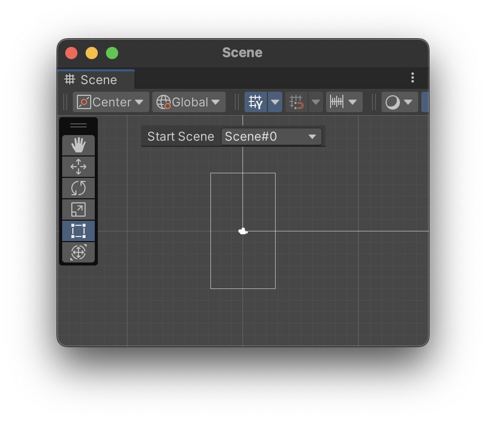

# unity-scene-tools

**A Unity Editor extension that lets you set a default Play Mode scene easily!**

## ✨ Features
✔️ Choose a **default scene** from a dropdown  
✔️ Automatically **updates when new scenes are added**  
✔️ Centered UI in **Scene View toolbar**  
✔️ Saves your selection between Unity sessions  

## 🚀 Installation
1. Clone the repo or download the `Editor/PlaySceneDropdown.cs` file.
2. Place it inside your Unity project under `Assets/Editor/`.
3. Restart Unity, and the dropdown will appear in the **Scene View**.

## 📖 Usage
- Open **Scene View**.
- Select a default scene from the dropdown at the **top center**.
- Press **Play**, and the selected scene will always start first!

## 💡 Contribution Guide
See [CONTRIBUTING.md](CONTRIBUTING.md) for more details.

## 📄 License
This project is licensed under the [MIT License](LICENSE).
